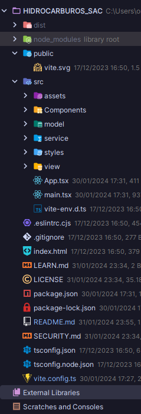

# PROYECTO HIDROCARBUROS

Este proyecto tiene como objetivo desarrollar una aplicación web que permita a los usuarios seleccionar productos de un
catálogo, especificar la cantidad deseada de cada producto y generar un informe en formato PDF con la información
seleccionada.

## Índice

- [Instalación](#instalación)
- [Ejecución del Proyecto](#ejecución-del-proyecto)
- [Estructura del Proyecto](#estructura-del-proyecto)
- [Funcionalidades](#Funcionalidades)
- [Contribuir](#contribuir)

## Instalación

Asegúrate de tener [Node.js](https://nodejs.org/) instalado en tu máquina.

1. Clona el repositorio

```bash
git clone https://github.com/tu-usuario/tu-proyecto.git
```

2. Entra al directorio del proyecto

```bash
cd HIDROCARBUROS_SAC  
```

3. Instala las dependencias

```bash
npm install
```

## Ejecución del Proyecto

1. Inicia la aplicación en modo desarrollo

```bash
npm run dev
```

2. Construye la aplicación para producción

```bash
npm run build
```

3. Inicia la aplicación en modo producción después de construir

```bash
npm start
```
## Estructura del Proyecto




## Funcionalidades

* **Selección de Productos:** Los usuarios pueden explorar un catálogo de productos y seleccionar aquellos que deseen
  incluir
  en el informe.

* **Especificación de Cantidades:** Para cada producto seleccionado, los usuarios pueden especificar la cantidad que
  desean.

* **Generación de Informe PDF:** Después de completar la selección, los usuarios pueden generar un informe en formato
  PDF que
  incluye la lista de productos seleccionados y las cantidades especificadas.

## Contribuir

`¡Gracias por considerar contribuir! Si deseas contribuir a este proyecto, sigue estos pasos:`

### Crea un fork del repositorio.

1. Crea una nueva rama para tu función _(git checkout -b feature/nueva-funcion)_.
2. Haz tus cambios y realiza un commit _(git commit -m 'Añadir nueva función')_.
3. Haz push de tus cambios a la rama _(git push origin feature/nueva-funcion)_.
4. Abre una solicitud de extracción en GitHub.